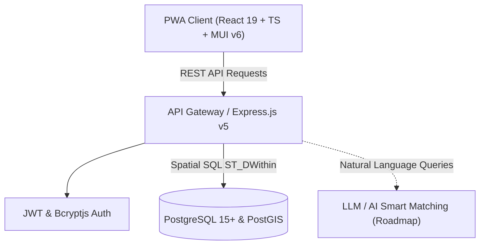

# 📋 План реализации и дорожная карта проекта «Попутка ИИ»

> **Проект:** Студенческий карпулинг (райдшеринг) для студентов Уральского федерального университета (УрФУ).  
> **Миссия:** Обеспечить доступные, безопасные и быстрые поездки между центром Екатеринбурга и удаленным кампусом Новокольцовский по справедливой фиксированной цене с компенсацией расходов водителя.

---

## 🏗 Архитектурное видение системы

---

## 🎯 Статус реализации модулей (Current Status)

### 🟢 1. Инфраструктура, база данных и гео-ядро (100% Завершено)
- [x] Развернута реляционная база данных **PostgreSQL** с расширением **PostGIS 3.6+**.
- [x] Спроектированы таблицы: `users`, `vehicles`, `rides`, `matches`, `reviews`.
- [x] Настроены пространственные индексы WGS 84 (`geometry(Point, 4326)`).
- [x] Реализован гео-поиск через `ST_DWithin` с приведением к типу `geography` и настраиваемым радиусом (по умолчанию 1000 м).
- [x] Высокоточный расчет дистанции по сфере Земли через `ST_DistanceSphere`.
- [x] Полная очистка кодовой базы от моковых данных — система функционирует исключительно на реальных данных БД.

### 🟢 2. Авторизация, профиль и верификация (100% Завершено)
- [x] Авторизация по уникальному `username` и паролю с криптографическим хешированием **bcryptjs** (10 раундов).
- [x] Выпуск и валидация токенов **JWT** (срок действия 7 дней).
- [x] **Обязательный номер телефона при регистрации:** поле `phone` является строго обязательным при `POST /api/auth/register`.
- [x] **Редактирование профиля:** эндпоинт `PATCH /api/auth/me` для обновления телефона и Telegram-username.
- [x] **Загрузка аватара:** поддержка JPEG/PNG/WEBP до 5 МБ с проверкой сигнатур magic bytes (`POST /api/auth/me/avatar`).

### 🟢 3. Гараж автомобилей водителя (100% Завершено)
- [x] Регистрация личных авто водителя (`POST /api/vehicles`) и просмотр гаража (`GET /api/vehicles`).
- [x] **Учет количества мест (`seats`):** указание вместимости от 1 до 8 мест при добавлении авто.
- [x] **Редактирование авто в гараже:** эндпоинт `PATCH /api/vehicles/:id` для обновления марки, цвета, госномера и мест.
- [x] **Строгая блокировка создания поездки без авто:** если у водителя нет машин в гараже, интерфейс блокирует создание маршрута и направляет в профиль.

### 🟢 4. Экономика и ценообразование (100% Завершено)
- [x] **Отмена динамического Split Fare:** упразднена плавающая модель перерасчета стоимости между пассажирами.
- [x] **Фиксированная цена за место:** введена модель фиксированной стоимости за одно посадочное место (`current_price = base_price`).
- [x] Базовый тариф **6 руб/км**.
- [x] Автоматическое выявление утренних (`07:30–09:30`) и вечерних (`17:00–19:00`) часов пик с коэффициентом **x1.3**.
- [x] Возможность ручного переопределения цены за место водителем.

### 🟢 5. Маршруты, расписание и управление поездкой (100% Завершено)
- [x] **Поддержка Одноразовых (`one_off`) и Регулярных (`regular`) поездок:** разовые по календарной дате и времени, регулярные по дням недели (`regular_days`: Пн, Вт, Ср, Чт, Пт...).
- [x] **Просмотр пассажиров водителем:** карточка поездки отображает список попутчиков с именами, аватарками, телефонами и Telegram.
- [x] **Исключение пассажиров водителем:** эндпоинт `DELETE /api/rides/:id/passengers/:passengerId` с автоматическим возвратом места (`available_seats + 1`).
- [x] **Редактирование маршрута создателем:** эндпоинт `PATCH /api/rides/:id` для корректировки адресов, времени, мест, цены и дней недели.
- [x] **Прямая телефонная связь:** кнопка «Позвонить» (`tel:...`) в карточке поездки для быстрой связи пассажира с водителем.
- [x] Атомарное бронирование и отмена мест с защитой от race conditions (`SELECT ... FOR UPDATE`).

### 🟢 6. Доверие, рейтинги и безопасность (100% Завершено)
- [x] Двустороннее оценивание поездок (1–5 звезд) и текстовые отзывы (`/api/reviews`).
- [x] Автоматический пересчет среднего рейтинга в реальном времени (`users.rating`).
- [x] Защитные заголовки **Helmet**, rate-limiting авторизации (`express-rate-limit`), CORS-политики.
- [x] Скрытая панель администратора (`/admin` или `#admin`) со статистикой и возможностью блокировки пользователей.

### 🟢 7. Автоматизированное тестирование (100% Завершено)
- [x] Комплекс из 9 сквозных smoke-тестов (`smoke-test.js`), валидирующих авторизацию, PostGIS-поиск, часы пик, бронирование, отзывы и автомобили.

---

## 🚀 Дорожная карта (Roadmap) будущих релизов

| Этап | Фича | Описание | Приоритет |
|---|---|---|:---:|
| **v1.1** | **LLM Smart Parsing** | Интеграция языковой модели для распознавания текстовых запросов («еду завтра в 8 утра от Уралмаша») в параметры маршрута | 🟡 Средний |
| **v1.2** | **PWA Push-уведомления** | Нотификации об изменении состава пассажиров, подтверждении бронирования и начале поездки | 🟡 Средний |
| **v1.3** | **Живой GPS-трекинг** | Отображение перемещения машины водителя на карте в реальном времени перед подачей | 🟢 Низкий |
| **v1.4** | **Внутривузовская верификация** | Интеграция с университетским LDAP/SSO или корпоративной почтой УрФУ | 🟢 Низкий |

---

## 🏆 Чеклист готовности к защите проекта

- [x] Полностью рабочий Backend на Node.js / Express v5 / PostgreSQL / PostGIS.
- [x] Адаптивный мобильный PWA Frontend на React 19 + TypeScript + MUI v6.
- [x] Актуальная база данных без тестовых заглушек и моков.
- [x] Реализованы все ключевые бизнес-сценарии:
  - Регистрация с подтверждением телефона;
  - Добавление и редактирование автомобилей с учетом мест;
  - Публикация разовых и регулярных поездок;
  - Поиск попутчиков по гео-координатам и радиусу;
  - Прозрачная фиксированная оплата за место;
  - Взаимодействие водителя и пассажиров (звонки, чат, исключение, редактирование маршрута);
  - Система взаимных отзывов и рейтингов.
- [x] 100% прохождение автоматических тестов API.
- [x] Полный комплект технической документации в репозитории.
