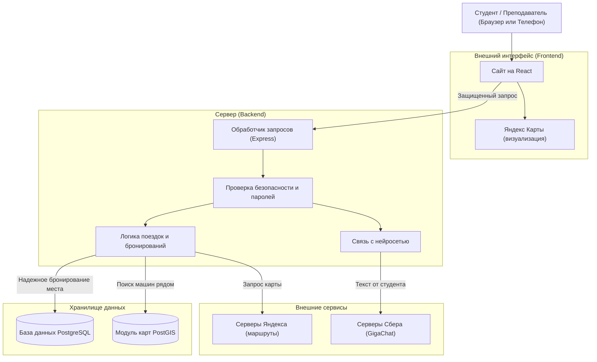

<div align="center">

# 🚕 Попутка ИИ (УрФУ Карпулинг)

### Умный сервис совместных поездок для студентов и преподавателей УрФУ
**Маршрут: Главный учебный корпус (ГУК) ⇄ Кампус «Новокольцовский»**

---

[](https://react.dev/)
[](https://vite.dev/)
[](https://mui.com/)
[](https://www.typescriptlang.org/)
[](https://nodejs.org/)
[](https://expressjs.com/)
[](https://www.postgresql.org/)
[](https://postgis.net/)
[](https://yandex.ru/dev/maps/)
[](https://developers.sber.ru/portal/products/gigachat)

</div>

---

## 📖 О проекте

**«Попутка ИИ»** — это сервис, который помогает студентам УрФУ быстро, дешево и с комфортом добираться до университета. Сервис связывает исторические корпуса в центре Екатеринбурга с удаленным кампусом в Новокольцовском районе.

Вместо того чтобы ждать переполненный автобус или платить огромные деньги за коммерческое такси, студенты могут кооперироваться с однокурсниками, у которых есть машины. Водитель экономит на бензине, а пассажир доезжает с комфортом и в хорошей компании!

### ⚖️ Сравнение вариантов поездки

| Критерий | 🚌 Автобусы | 🚕 Коммерческое такси | 🚗 Попутка ИИ (УрФУ) |
| :--- | :---: | :---: | :---: |
| **Время в пути** | 60–90 мин (с пересадками) | 25–40 мин | **20–35 мин (прямой маршрут)** |
| **Средняя стоимость** | ~35–70 ₽ | 450–900 ₽ | **70–150 ₽ (компенсация бензина)** |
| **Комфорт** | Переполненный салон | Индивидуально | **Гарантированное сидячее место** |
| **Окружение** | Случайные пассажиры | Незнакомый водитель | **Студенческое комьюнити** |
| **Поиск поездки** | Расписание на остановках | Долгое ожидание | **Умный поиск с ИИ (напиши текстом)** |

---

## 🌟 Главные фишки проекта

| Функция | Описание и технические детали |
| :--- | :--- |
| 🗺️ **Интеграция Яндекс Карт** | Интерактивные карты с отрисовкой маршрутов по реальным дорогам. Помогают водителю и пассажиру точно понять, где они встретятся. |
| 🤖 **Умный поиск (GigaChat)** | Пассажиру не нужно заполнять десятки фильтров. Нейросеть понимает студенческий сленг (например, *«Завтра от ГУКа в Новокольцово к 8:30»*) и сама находит подходящую машину. |
| 📍 **Поиск попутчиков по пути** | Система сама анализирует маршруты и предлагает водителям пассажиров, которых удобно забрать по дороге, не делая больших крюков (используется технология PostGIS). |
| 🛡️ **Гарантия места (Защита от сбоев)** | Наш сервер надежно защищает поездки от двойных бронирований. Два человека физически не смогут занять одно и то же последнее место в машине. |
| 🔐 **Безопасность и Админка** | Регистрация защищена паролями. Есть панель администратора для модерации поездок и защита сервера от атак и перегрузок. |
| 📱 **Установка без AppStore (PWA)** | Сервис работает прямо в браузере, но его можно в один клик установить на экран телефона. Он выглядит и работает как полноценное приложение. |
| 🔁 **Регулярные поездки** | Водитель может настроить расписание один раз (например, "каждую среду к 8:30"), и система сама будет собирать попутчиков на нужный день недели. |
| ⭐ **Система отзывов** | После поездки участники оценивают друг друга (от 1 до 5 звезд). Это формирует безопасное студенческое сообщество. |

## 🛠 Технологический стек

### 💻 Внешний вид (Frontend)
| Технология | Назначение | Бейдж |
| :--- | :--- | :--- |
| **React 19** | Создание красивого и быстрого интерфейса |  |
| **Vite 8** | Высокоскоростной запуск и сборка проекта |  |
| **MUI v7** | Готовые элементы дизайна (кнопки, карточки) |  |
| **TypeScript 5.9** | Защита от ошибок в коде на этапе написания |  |

### ⚙️ Мозг и База данных (Backend)
| Технология | Назначение | Бейдж |
| :--- | :--- | :--- |
| **Node.js 20+** | Сердце проекта, обрабатывающее все запросы |  |
| **Express 5** | Удобный каркас для создания серверной логики |  |
| **PostgreSQL 15+** | Надежная база данных для хранения профилей и поездок |  |
| **PostGIS 3.6** | Умный модуль для работы с гео-координатами и картами |  |

### 🌐 Внешние интеграции и ИИ
| Сервис / API | Назначение | Бейдж |
| :--- | :--- | :--- |
| **Yandex Maps API** | Отрисовка интерактивной карты и маршрутов |  |
| **GigaChat-Pro** | Нейросеть от Сбера для понимания текста студентов |  |

---

## 🏛 Архитектура решения



---

## 🚀 Быстрый старт (Для разработчиков)

### 1️⃣ Настройка и запуск сервера (Backend)

```bash
# Перейдите в директорию бэкенда
cd backend

# Установите зависимости
npm install

# Примените структуру базы данных:
npm run migrate

# Запустите сервер (по умолчанию порт 3000):
npm start
```

### 2️⃣ Настройка и запуск клиента (Frontend)

В отдельном терминале выполните:

```bash
# Перейдите в директорию фронтенда
cd frontend

# Установите зависимости
npm install

# Запустите сайт для разработчиков:
npm run dev
```

Откройте веб-приложение в браузере: **`http://localhost:5173`**

---

<div align="center">
  <sub>Разработано командой MusorDrop с ❤️ для студентов и преподавателей УрФУ</sub>
</div>
