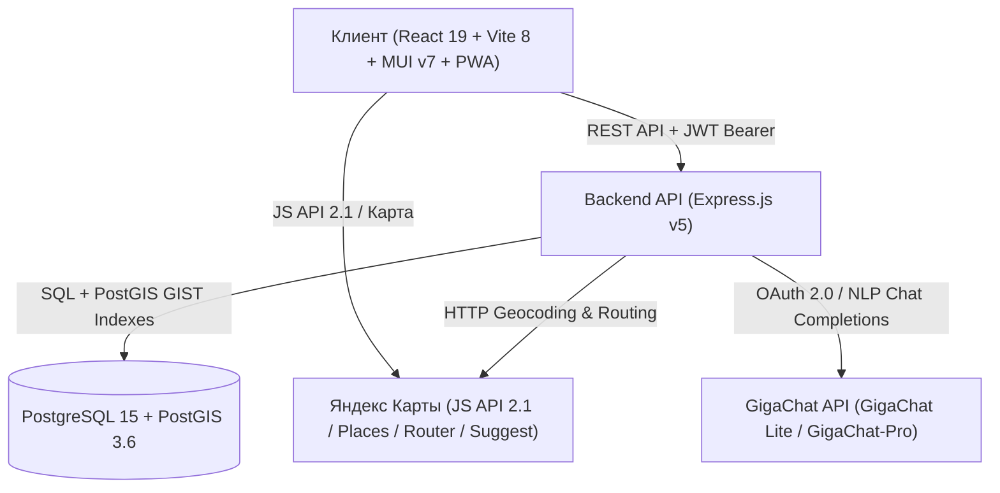

<div align="center">
  <h1>🚕 Попутка ИИ — Умный студенческий карпулинг для УрФУ</h1>
  <p><b>Сервис совместных поездок между кампусами Екатеринбурга и новым кампусом в Новокольцовском на базе искусственного интеллекта и Яндекс Карт.</b></p>

  <p>
    
    
    
    
    
    
    
    
    
    
  </p>
</div>

---

## 📌 О проекте

**«Попутка ИИ»** — специализированная платформа совместных поездок (карпулинг), созданная для решения транспортной задачи студентов и преподавателей Уральского федерального университета (УрФУ). Сервис связывает исторические корпуса в центре Екатеринбурга (Мира, Ленина, Тургенева) с отдаленным кампусом в **Новокольцовском**.

### Главные преимущества:
- **Пассажиры:** добираются до кампуса быстро и с комфортом, в 4–6 раз выгоднее коммерческих такси и без давки в общественном транспорте.
- **Водители:** компенсируют расходы на топливо по честному и понятному тарифу.
- **Безопасность:** закрытое студенческое сообщество, честный рейтинг (1–5 звезд), проверенные контакты (телефон, Telegram).

---

## ✨ Ключевые возможности

- 🤖 **Интеллектуальный NLP-поиск (GigaChat / GigaChat-Pro):** ввод запросов свободным текстом (например, *"Завтра в 8:30 с Уралмаша в Новокольцово"*). Модель структурирует запрос в параметры маршрута и фильтрует доступные поездки.
- 🗺️ **Интеграция с Яндекс Картами & Places API:**
  - Отрисовка интерактивной карты маршрута с полилиниями реальных дорог (`LineString`);
  - Быстрый ввод адресов и кампусов УрФУ через Yandex Suggest и Places API;
  - Двухуровневое кэширование адресов в PostgreSQL (`geocode_cache`) и резервный словарь ориентиров Екатеринбурга.
- 🧮 **Прозрачный фиксированный тариф:**
  - Отказ от динамического Split Fare: фиксированная стоимость посадочного места;
  - Базовый тариф — **6 ₽/км**;
  - Коэффициент часа пик — **x1.3** (утро: `07:30–09:30`, вечер: `17:00–19:00`);
  - Возможность для водителя задать индивидуальную цену за место.
- 🚗 **Гараж автомобилей и защита от овербукинга:**
  - Учет вместимости (от 1 до 8 мест) и жесткий запрет публикации маршрута без автомобиля;
  - Атомарные транзакции с блокировкой строк (`FOR UPDATE`) исключают овербукинг мест.
- 📱 **Адаптивный PWA-интерфейс:**
  - Поддержка мобильных жестов, нижней навигации `BottomNav`, безопасных зон (`safe-area`);
  - Динамическое переключение светлой и темной темы (MUI v7);
- ⭐ **Двусторонняя система репутации:** честная оценка поездок (от 1 до 5 звезд) с автоматическим пересчетом рейтинга пользователей в базе данных.

---

## 🏗 Архитектура системы



---

## 🚀 Быстрый старт

### 1. Серверная часть (Backend)
```bash
cd backend
npm install

# Создайте файл .env (см. пример в backend/README.md)
# Примените миграции базы данных PostgreSQL + PostGIS:
npm run migrate

# Запустите сервер API (порт 3000):
npm start
```

### 2. Клиентская часть (Frontend)
```bash
# В отдельном терминале:
cd frontend
npm install

# Запустите клиентский dev-сервер Vite (порт 5173):
npm run dev
```

Откройте в браузере: **`http://localhost:5173`**

---

## 📚 Документация подсистем

- 📘 **[Backend API Документация](./backend/README.md)** — архитектура Express.js, PostgreSQL/PostGIS, схемы таблиц, миграции, `.env`, спецификация эндпоинтов, Яндекс Карты и GigaChat.
- 📙 **[Frontend Документация](./frontend/README.md)** — стек React 19 + Vite 8 + MUI v7, хуки Яндекс Карт API 2.1 (`useRouteMap`, `useAddressSuggest`), экраны и запуск.

---
*Разработано с ❤️ для студентов и преподавателей УрФУ*
