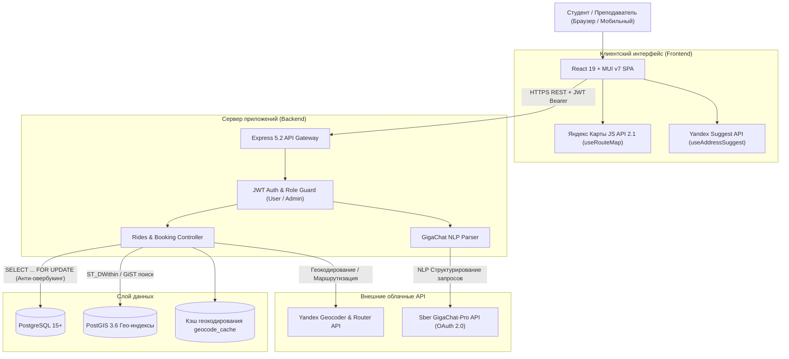

<div align="center">

# 🚕 Попутка ИИ (УрФУ Карпулинг)

### Интеллектуальный сервис совместных поездок для студентов и преподавателей УрФУ
**Маршрут: Главный учебный корпус (ГУК) ⇄ Кампус «Новокольцовский»**

---

[](https://react.dev/)
[](https://vite.dev/)
[](https://mui.com/)
[](https://www.typescriptlang.org/)
[](https://nodejs.org/)
[](https://expressjs.com/)
[](https://www.postgresql.org/)
[](https://postgis.net/)
[](https://yandex.ru/dev/maps/)
[](https://developers.sber.ru/portal/products/gigachat)

</div>

---

## 📖 О проекте

**«Попутка ИИ»** — специализированный сервис совместных поездок (карпулинг), созданный для решения транспортной задачи студентов и преподавателей Уральского федерального университета (УрФУ). Сервис связывает исторические корпуса в центре Екатеринбурга (**ГУК на ул. Мира, 19**, корпуса на пр. Ленина и ул. Тургенева) с удаленным кампусом в **Новокольцовском районе** (общежития №1–5, учебные корпуса ИРИТ-РТФ, ЭУИМ, спортивный кластер).

### ⚖️ Сравнение вариантов поездки

| Критерий | 🚌 Автобусы (общественный транспорт) | 🚕 Коммерческое такси | 🚗 Попутка ИИ (УрФУ) |
| :--- | :---: | :---: | :---: |
| **Время в пути (час пик)** | 60–90 мин (с пересадками) | 25–40 мин | **20–35 мин (прямой маршрут)** |
| **Средняя стоимость** | ~35–70 ₽ | 450–900 ₽ | **70–150 ₽ (компенсация бензина)** |
| **Комфорт и места** | Переполненный салон, стоя | Индивидуально | **Гарантированное сидячее место** |
| **Окружение** | Случайные пассажиры | Незнакомый водитель | **Закрытое студенческое комьюнити** |
| **Поиск поездки** | По расписанию на остановках | Динамический тариф агрегатора | **Умный AI-поиск на естественном языке** |

---

## 🌟 Ключевые возможности

| Функция | Описание и технические детали |
| :--- | :--- |
| 🗺️ **Интеграция Yandex Maps** | Интерактивные карты с точной отрисовкой маршрутов по реальным дорогам (`LineString`), подсказки корпусов и адресов Екатеринбурга через Yandex Suggest & Places API, двухуровневое кэширование геокоординат в PostgreSQL (`geocode_cache`). |
| 🤖 **GigaChat-Pro (AI парсинг)** | Нейросетевая обработка запросов на естественном языке (например, *«Завтра около 8:30 утра нужно от ГУКа в Новокольцово»*). Модель автоматически извлекает параметры маршрута, время и фильтрует доступные поездки. |
| 📍 **PostGIS гео-поиск** | Пространственные индексы GiST, точный расчет расстояний и радиусов доступности (`ST_DWithin`, `ST_Distance`). Позволяет пассажирам находить водителей, чей маршрут пролегает рядом. |
| 🛡️ **Защита от овербукинга** | Атомарные транзакции базы данных с блокировкой строк (`SELECT ... FOR UPDATE`). Полностью исключает конфликт одновременного бронирования одного и того же места. |
| 🔐 **JWT-админка & Безопасность** | Ролевой контроль доступа (`user`, `admin`), панель управления и модерации, защита заголовков через `helmet`, лимитирование частоты запросов `express-rate-limit` и безопасное хеширование паролей (`bcryptjs`). |
| 🚗 **Гараж автомобилей & Честный тариф** | Учет автомобилей водителей (1–8 мест), валидация вместимости, расчет стоимости по прозрачной формуле (базовый тариф 6 ₽/км с пиковым коэффициентом x1.3: утро `07:30–09:30`, вечер `17:00–19:00`). |
| ⭐ **Двусторонняя репутация** | Оценка поездок (1–5 звезд) с взаимными отзывами и автоматическим пересчетом рейтинга водителей и пассажиров. |

## 🛠 Технологический стек

### 💻 Frontend
| Технология | Назначение | Бейдж |
| :--- | :--- | :--- |
| **React 19** | Реактивная библиотека пользовательского интерфейса |  |
| **Vite 8** | Высокоскоростной инструмент сборки и dev-сервер |  |
| **MUI v7** | Компонентная система Material UI + светлая/тёмная темы |  |
| **TypeScript 5.9** | Строгая статическая типизация модулей и компонентов |  |
| **React Router 7** | Клиентская декларативная маршрутизация SPA |  |

### ⚙️ Backend & База данных
| Технология | Назначение | Бейдж |
| :--- | :--- | :--- |
| **Node.js 20+** | Серверная среда выполнения JavaScript |  |
| **Express 5** | RESTful HTTP/JSON микросервисный каркас |  |
| **PostgreSQL 15+** | Реляционная СУБД с поддержкой транзакций ACID |  |
| **PostGIS 3.6** | Геопространственное расширение и GiST-индексация |  |
| **JWT + Bcrypt** | Авторизация RFC 7519 и безопасное хеширование паролей |  |

### 🌐 Внешние интеграции & ИИ
| Сервис / API | Назначение | Бейдж |
| :--- | :--- | :--- |
| **Yandex Maps JS API 2.1** | Интерактивная карта, маркеры и дорожная сеть |  |
| **Yandex Places / Suggest** | Автодополнение адресов и поиск кампусов УрФУ |  |
| **GigaChat-Pro (Сбер AI)** | NLP-парсинг неструктурированных текстовых запросов |  |

---

## 🏛 Архитектура решения



---

## 🚀 Быстрый старт (Quick Start)

### 📋 Предварительные требования
- **Node.js** версии `20.x` или новее
- **PostgreSQL 15+** с установленным расширением **PostGIS**
- Ключ разработчика **Yandex Maps API**
- Учетные данные **GigaChat API** (Client ID / Client Secret)

---

### 1️⃣ Настройка и запуск серверной части (Backend)

```bash
# Перейдите в директорию бэкенда
cd backend

# Установите зависимости
npm install

# Создайте файл .env (см. backend/README.md для примера всех переменных)
# Настройте подключение к БД PostgreSQL и внешние ключи:
# DB_HOST=localhost
# DB_PORT=5432
# DB_NAME=taksi
# DB_USER=postgres
# DB_PASSWORD=your_password
# JWT_SECRET=your_jwt_secret_key
# YANDEX_MAPS_API_KEY=your_yandex_key
# GIGACHAT_CLIENT_ID=your_client_id
# GIGACHAT_CLIENT_SECRET=your_client_secret

# Примените схему и миграции базы данных (PostgreSQL + PostGIS):
npm run migrate

# Запустите API сервер (по умолчанию порт 3000):
npm start
```

Проверка работоспособности бэкенда (Smoke-тест):
```bash
npm run test:smoke
```

---

### 2️⃣ Настройка и запуск клиентской части (Frontend)

В отдельном терминале выполните:

```bash
# Перейдите в директорию фронтенда
cd frontend

# Установите зависимости
npm install

# Запустите клиентский dev-сервер Vite (порт 5173):
npm run dev
```

Откройте веб-приложение в браузере: **`http://localhost:5173`**

---

## 📂 Структура репозитория

```text
taksi/
├── backend/                  # REST API сервер на Express 5 & PostgreSQL
│   ├── db/                   # Миграции схемы БД, подключение pg pool, фиксы индексов
│   ├── middleware/           # JWT аутентификация, валидаторы, helmet, rate-limit
│   ├── routes/               # Эндпоинты: auth, rides, bookings, cars, reviews, admin
│   ├── services/             # Интеграции: GigaChat AI парсинг, Yandex геокодер
│   ├── index.js              # Точка входа Express бэкенда
│   └── README.md             # Детальная документация API бэкенда
│
├── frontend/                 # Клиентское приложение React 19 + Vite + MUI v7
│   ├── src/
│   │   ├── components/       # UI компоненты (карточки, модалки, списки)
│   │   ├── hooks/            # Хуки Яндекс Карт (useRouteMap, useAddressSuggest)
│   │   ├── pages/            # Страницы: поиск, поездки, профиль, гараж, админка
│   │   ├── theme/            # Темизация MUI (светлая / темная палитра)
│   │   └── App.tsx           # Корневой компонент и декларативный роутер
│   ├── vite.config.ts        # Конфигурация Vite
│   └── README.md             # Детальная документация фронтенда
│
└── README.md                 # Главная документация проекта
```

---

## 📚 Документация подсистем

- 📘 **[Backend API Документация](./backend/README.md)** — архитектура Express.js, PostgreSQL/PostGIS, схемы таблиц, миграции, `.env`, спецификация эндпоинтов, Яндекс Карты и GigaChat.
- 📙 **[Frontend Документация](./frontend/README.md)** — стек React 19 + Vite 8 + MUI v7, хуки Яндекс Карт API 2.1 (`useRouteMap`, `useAddressSuggest`), экраны и запуск.

---
# Пул вопросов от жюри (Хакатон: Попутка ИИ)

## 1. Блок Технологий и Разработки (Для разработчиков)
**Вопрос (Каверзный):** Вы говорите, что сделали веб-версию, чтобы не нужно было скачивать приложение. Но для таких сервисов (как Убер или Яндекс) важна геолокация в фоне и пуш-уведомления. Как веб-сайт с этим справится?
**Ответ:** Наш сайт — это PWA (Progressive Web App). Его можно установить на экран телефона в один клик прямо из браузера, и он будет работать как нативное приложение. PWA позволяет запрашивать геолокацию и в будущем отправлять пуш-уведомления.

**Вопрос:** Вы упомянули, что база данных пересчитывает места для регулярных поездок. А что будет, если два человека одновременно нажмут "Забронировать" на последнее место?
**Ответ:** Наша база данных (PostgreSQL) использует транзакции и атомарные обновления. При бронировании мы делаем проверку и изменение за один шаг на уровне базы, поэтому "гонки данных" исключены. Место достанется тому, чей запрос пришел на миллисекунду раньше.

**Вопрос (Каверзный):** Ваша ссылка для показа (musordrop.github.io/taksi) — это только фронтенд. А где крутится бэкенд и ИИ?
**Ответ:** Для презентации наш бэкенд развернут локально и безопасно прокинут в сеть через туннель Pinggy. Это позволило нам за хакатон собрать сложную микросервисную архитектуру, не тратя время на покупку серверов и сложный деплой.

## 2. Блок Искусственного Интеллекта (Для Промпт-инженеров)
**Вопрос:** Вы говорите, что ИИ помогает найти поездку. А что если пользователь напишет "Хочу поехать от общаги до радика в среду вечером"? ИИ поймет этот сленг?
**Ответ:** Да! В этом и заключается суть внедрения NLP. Мы настроили системный промпт, который "знает" студенческий сленг УрФУ (радик, гук, новоколя). Модель вытаскивает из этого текста четкие параметры и автоматически применяет их к фильтрам.

**Вопрос (Каверзный):** Вы сказали, что связали ИИ с Яндекс.Картами и пробками для расчета цены. Как именно это работает под капотом? (Учитывая, что в MVP этого еще нет)
**Ответ:** Архитектурно мы спроектировали это так: координаты точек передаются в API Яндекс.Маршрутизации. Мы получаем дистанцию с учетом пробок. Затем эти данные скармливаются промпту LLM, которая выдает рекомендованный прайс. В текущем прототипе водитель ставит цену сам, но архитектура для этой интеграции уже готова.

## 3. Блок Дизайна и UX (Для Дизайнера)
**Вопрос:** Вы использовали синий цвет ИРИТ-РТФ. Не боитесь, что студенты других институтов не захотят пользоваться "чужим" сервисом?
**Ответ:** Синий цвет ассоциируется с надежностью и технологичностью. Но архитектура нашего приложения (React) поддерживает динамические темы. Мы можем легко внедрить адаптивные цветовые схемы в зависимости от института пользователя.

**Вопрос:** Форма создания поездки кажется большой. Не слишком ли сложно водителю каждый раз вводить все данные?
**Ответ:** Мы максимально упростили флоу. Данные вроде номера телефона и Телеграма подтягиваются автоматически из профиля. Более того, мы сделали функцию "Регулярные поездки", где маршрут создается один раз.

## 4. Блок Бизнеса, Аналитики и Продукта (Для Тимлида/Аналитика)
**Вопрос (Убойный):** В УрФУ уже есть беседы в ВК и Телеграме, где люди ищут попутчиков в Новокольцовский. Зачем им переходить в ваше приложение?
**Ответ:** Беседы в ТГ — это хаос. Там нет гарантии свободных мест, нужно листать сотни сообщений, договариваться в личке, и нет системы безопасности. У нас студент зашел, вбил "завтра в 8:30" (или сказал это ИИ), нажал одну кнопку — и место забронировано. Водителю не нужно отвечать 10 людям.

**Вопрос:** Вы упомянули Split Fare (разделение стоимости). Если один из попутчиков откажется платить, кто будет покрывать разницу?
**Ответ:** На этапе MVP оплата происходит переводом между студентами (Split Fare работает как калькулятор для водителя, чтобы показать, сколько скидываться). В полноценном продукте мы планируем прикрутить эквайринг и замораживать средства на картах попутчиков в момент бронирования.

**Вопрос:** Откуда вы возьмете первых водителей?
**Ответ:** Проблема курицы и яйца. Мы начнем с агрессивного промо на парковках Новокольцовского кампуса. Мы дадим первым водителям статус "VIP" и нулевую комиссию на полгода. Плюс запустим реферальную систему "Приведи друга на машине — получи бесплатную поездку".

---

# ⚠️ ОШИБКИ И РАСХОЖДЕНИЯ С РЕАЛЬНЫМ КОДОМ (ФАКТЧЕКИНГ)
*Обязательно прочитайте это перед выходом к жюри, чтобы вас не поймали на лжи, если попросят показать экран во время демо!*

1. **YandexGPT vs GigaChat:**
   - **В речи:** «Мы взяли готовое API YandexGPT...»
   - **Реальность:** В коде везде используется "GigaChat". Интерфейс сайта прямо пишет «Распознано GigaChat» в блоке фильтров. 
   - **Что делать:** Поправьте в речи "YandexGPT" на "GigaChat", иначе на демке жюри заметят надпись на экране и зададут неудобный вопрос.

2. **Интеграция с Яндекс.Картами, пробками и расчет цены бензина:**
   - **В речи:** «система смотрит на пробки, расстояние, считает цену бензина на пассажиров и выдает водителю готовую умную подсказку цены...»
   - **Реальность:** Этого функционала в коде **НЕТ**. Водитель сейчас вводит цену руками при создании поездки.
   - **Что делать:** Измените формулировку в речи с "система смотрит и выдает" на "Мы спроектировали архитектуру, где система *будет* смотреть на пробки...". Если жюри попросит показать эту умную подсказку цены на демо — вы не сможете этого сделать, так как её нет.

3. **Функция Split Fare (Разделение стоимости):**
   - **В речи:** «И, конечно, мы добавляем функцию разделения стоимости — Split Fare...»
   - **Реальность:** В интерфейсе нет отдельной кнопки Split Fare, только обычная цена за место.
   - **Что делать:** Если спросят, как она работает, отвечайте, что сейчас это визуальный калькулятор, а автоматическое списание с разных карт появится после прикручивания эквайринга.

4. **Планы на будущее (Мобильное приложение):**
   - **В речи:** «Какие планы на будущее? Планируем выпустить мобильное приложение.»
   - **Реальность:** Вы **УЖЕ** сделали PWA (прогрессивное веб-приложение), которое устанавливается на телефон как нативное.
   - **Что делать:** Это ваш огромный козырь! Не говорите "планируем выпустить". Говорите: «Мы уже сделали PWA, которое ставится на экран телефона в один клик. В будущем мы просто обернем его в WebView и выложим в магазины приложений».

<div align="center">
  <sub>Разработано с ❤️ для студентов и преподавателей УрФУ</sub>
</div>

