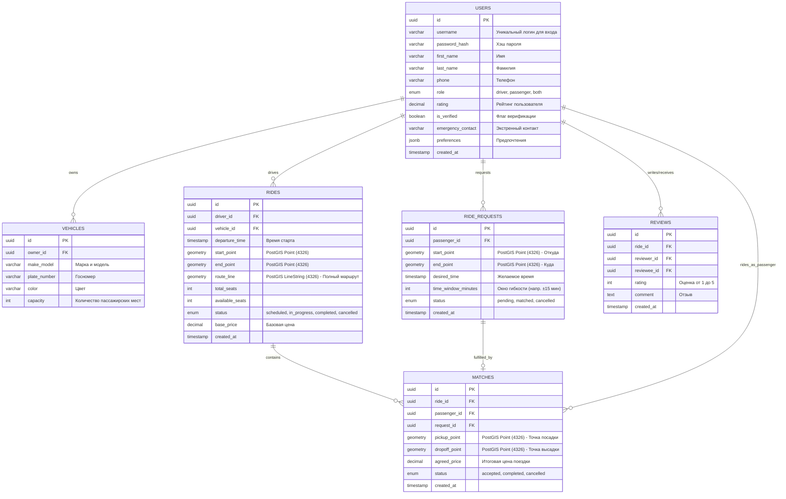

# Попутка ИИ — Backend (Серверная часть)

Здесь находится серверная часть проекта (API).

## Стек
- **Node.js** + **Express.js**
- **База данных:** PostgreSQL + PostGIS

## Запуск для разработки
1. Установите зависимости:
   ```cmd
   npm install
   ```
2. Запустите сервер:
   ```cmd
   node index.js
   ```

*Сервер будет слушать порт 3000.*

## Конфигурация (Скоро)
В будущем здесь появится файл `.env` для подключения к базе данных.

## Схема базы данных


